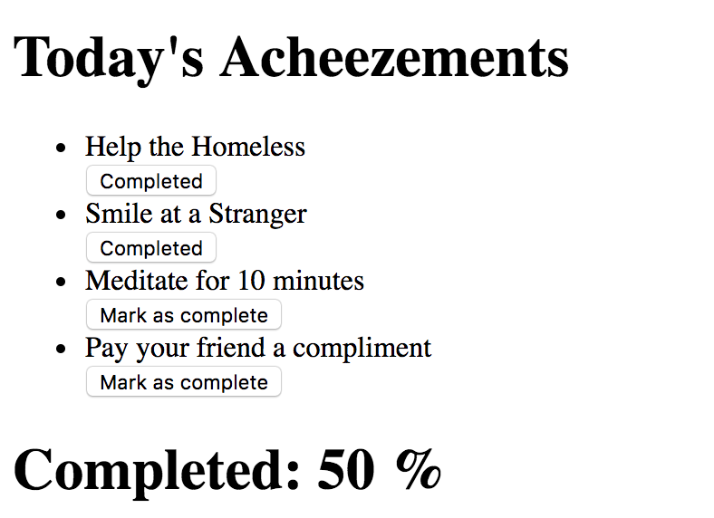

# Acheezeable

A cheesy self-led personal development app to encourage positivity during the achievement of goals.

## Installation

`git clone https://github.com/serenahathi/acheezable`

Run `npm install` to download dependencies

## How to Use

Run `node server/server.js` to launch server

Navigate to `http://localhost:3000`

## How to Test

`npm run cypress` to run feature tests via cypress.io

`npm run jest` to run unit tests via Jest

### MVP

###### User Stories

```
As a user,
So that I can work on my personal development today,
I would like to create some goals to track.

As a user,
So that I can be realistic about how many goals I can complete today,
I want to be restricted to four goals only.

As a user,
So that I can keep track of my goals,
I would like to be able to tick off goals when they’re met

As a user,
So that I can feel good about achieving my goals,
I would like some positive feedback once they’re all ticked off.
```

##### Features

* Input 4 goals for the day [x]
* User checks box when each goal is complete [x]
* When all goals are checked, a motivational message appears [x]

### MVP 2.0

###### User Stories

```
As a user,
So that I can set goals based on how much time I have,
I would like the flexibility to choose any number of goals per day.

As a user,
So that I can stay focused on Today's goals,
I would like to display Today's goals only.

As a user,
So that I can see how I am progressing with my goals,
I would like to convert my total completed goals into a completion percentage.
```

##### Features

* User can set any number of goals per day [x]
* User can navigate to Progress Tracker where only Today's goals are displayed [x]
* A completion percentage is displayed, and updates whenever a completion button is clicked [x]



## Acheezable 1.0.0

###### User Stories

```
As a user,
So that I can protect my user details,
I would like to be able to login and logout of my account securely.

As a user,
So that I can get straight to setting goals,
I would like to be taken to the goal creator page immediately after logging in.

As a user,
So that I can go straight back to the goals I have set,
I would like to be taken to the goal tracker page immediately after logging in.

As a user,
So that I can get inspiration for goals I would like to achieve,
I would like to get some appropriate suggestions.

As a user,
So that I can amend any typos to goals I have created,
I would like to be able to edit the text of the goal.

As a user,
So that I can stay motivated to achieve the goals I have set,
I would like to receive words of encouragement.

As a user,
So that I can feel a true sense of accomplishment for completing all of my goals,
I would like to receive some type of reward upon 100% completion.
```

##### Features

* User can sign up, login, and logout of their profile []
* If user logs in and has not created goals today, they will be prompted to create goals []
* If user logs in and has already created goals today, they will be directed to their progress tracker page []
* If user is struggling to create goals, they can click on a suggestions button and receive some inspiration []
* User can edit their goals if they have made a mistake []
* If user is struggling to complete goals, they can click on a 'motivational hit' button and receive some encouragement []
* When user completes a goal, they receive a motivational quote to keep going []
* When user completed all their goals, the page will redirect to a 'Big Reward' page that will encourage the user to treat themselves for doing so well []

## Authors

**Team Cheezers**:

* Terry Allitt
* Ben Challenor
* Serena Hathi
* Heather Stock
* Lewis Watson
